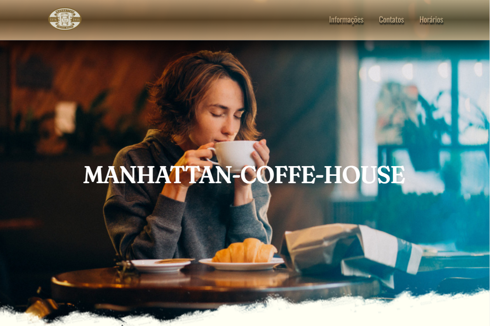

# Manhattan_Coffe_House
 
 Este projeto é a página web de uma cafeteria onde usei HTML E CSS para desenvolver,
 e tive a oportunidade de colocar em prática alguns conceitos de CSS que estudei, dentre eles: 
 -Propriedades 
 -Seletores 
 -Background(efeito parallax) 
 -Caixas(box model) 
 -Position (fixed, relative, absolute)

 *DEPLOY:
 https://danilo-tteles.github.io/Manhattan_Coffe_House/

